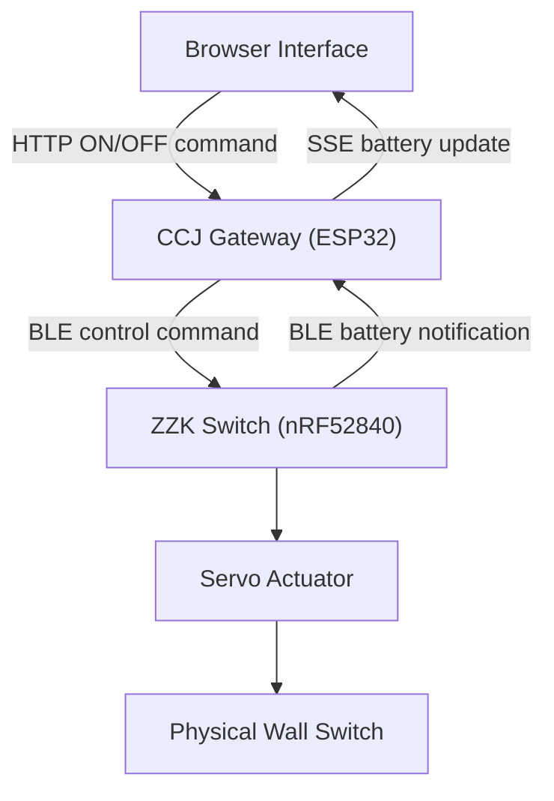

# CCJ Gateway

The CCJ Gateway is an ESP32-based Wi-Fi-to-BLE gateway that allows users to operate a physical dormitory light switch through a web interface and remotely monitor the battery level of the switch unit.

## System Overview

The CCJ Gateway and ZZK Switch form a web-controlled smart light switch system developed for use in a student dormitory. The system uses a servo motor to physically operate an existing wall switch without modifying the room's electrical wiring.

The CCJ Gateway connects to a Wi-Fi network and hosts the browser-based control interface. When the user selects an ON or OFF command, the gateway receives the HTTP request and writes a one-byte command to the ZZK Switch through Bluetooth Low Energy (BLE).

The ZZK Switch periodically measures its battery voltage and sends the estimated battery percentage to the gateway through BLE notifications. The gateway then pushes the latest value to the web interface using Server-Sent Events (SSE).

This repository contains the software for the CCJ Gateway. The switch-side software is available in the [ZZK Switch repository](https://github.com/coauther/ZZK-BLE-Switch-Assistant).

## Responsibilities of the CCJ Gateway

The CCJ Gateway is responsible for:

- Connecting to Wi-Fi and hosting the web control interface
- Receiving ON and OFF commands through an HTTP endpoint
- Scanning for nearby ZZK Switch devices
- Binding to a selected switch using its BLE MAC address
- Storing the selected MAC address in non-volatile memory
- Transmitting one-byte control commands through BLE
- Receiving battery-level notifications from the ZZK Switch
- Pushing battery updates to the webpage through SSE
- Automatically scanning for the switch again after disconnection

## System Architecture
The system uses the CCJ Gateway as a communication bridge between the browser-based user interface and the battery-powered ZZK Switch.

The system contains two main data flows:

1. **Light control:** The browser sends an HTTP request to the CCJ Gateway. The gateway converts the request into a one-byte BLE command and transmits it to the ZZK Switch, which then operates the servo motor.

2. **Battery monitoring:** The ZZK Switch measures its battery voltage through the ADC and periodically sends the estimated battery percentage through a BLE notification. The CCJ Gateway forwards the latest value to the browser using Server-Sent Events (SSE).

## Hardware and Software

| Category | Component or Technology |
|---|---|
| Development board | uPesy ESP32 Wroom DevKit |
| Programming language | C++ |
| Development framework | Arduino framework |
| Network connection | Wi-Fi |
| Web communication | HTTP and Server-Sent Events (SSE) |
| Device communication | Bluetooth Low Energy (BLE) |
| Web server | ESPAsyncWebServer |
| Data format | JSON and plain-text HTTP responses |
| Device identification | BLE service UUID and MAC address |
| Persistent storage | ESP32 Preferences |
| Companion device | Seeed Studio XIAO nRF52840 |

### Main Software Libraries

- `WiFi` for network connectivity
- `AsyncTCP` and `ESPAsyncWebServer` for the web server
- `BLEDevice` for BLE scanning and communication
- `Preferences` for storing the selected switch MAC address
- `ArduinoJson` for generating BLE scan results